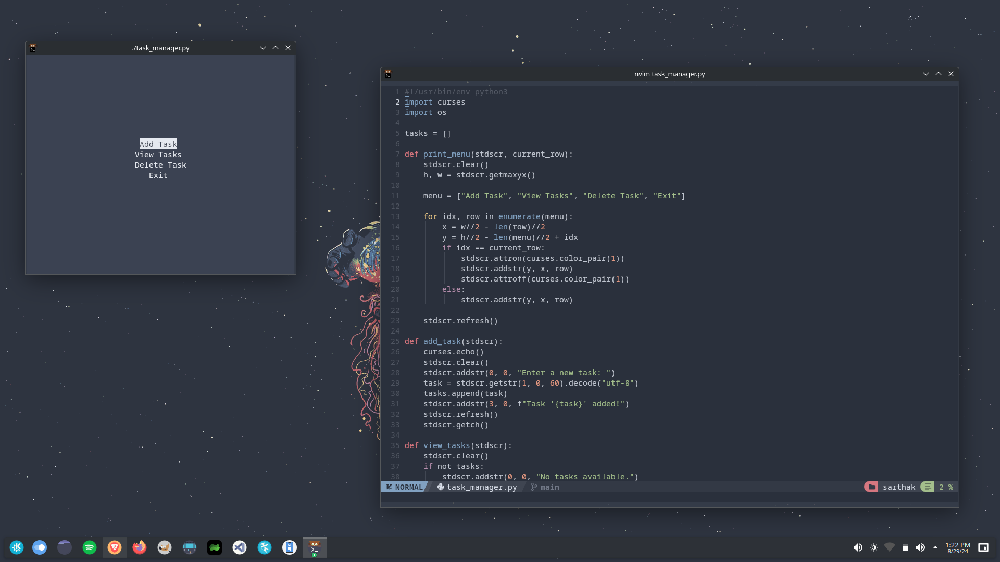

# Task Manager

Task Manager is a simple, terminal-based task manager built using Python's `curses` library. It allows you to add, view, and delete tasks directly from your terminal, making it a lightweight and efficient solution for task management.



## Features

- **Add Task**: Easily add new tasks with a simple interface.
- **View Tasks**: See all your tasks at a glance.
- **Delete Task**: Remove tasks that are no longer needed.
- **Minimalistic Design**: A clean and intuitive tui for managing tasks.

## Installation

1. Clone the repository:

    ```bash
    git clone https://github.com/codewithsarthak-2009/task_manager.git
    cd task_manager
    ```

2. Make the script executable:

    ```bash
    chmod +x task_manager.py
    ```

3. Run the task manager:

    ```bash
    ./task_manager.py
    ```

## Dependencies

- Python 3
- `curses` (included in the Python standard library)

## Usage

- **Navigate**: Use the arrow keys to navigate the menu.
- **Select**: Press `Enter` to select a menu option.
- **Add Task**: Enter a task description and press `Enter`.
- **View Tasks**: Display all current tasks.
- **Delete Task**: Enter the task number to delete it.

## Contributing

Feel free to fork this repository and submit pull requests. Contributions are welcome!

## License

This project is licensed under the MIT License. See the [LICENSE](LICENSE) file for details.

## Contact

For any questions or suggestions, please reach out to [Email](mailto:codewithsarthak@protonmail.com).
